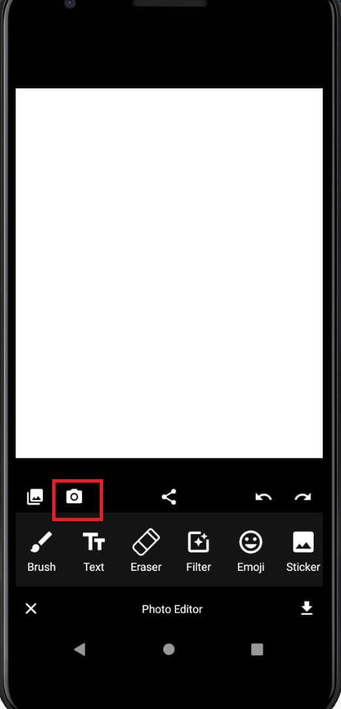

# Lab 8

As it is image editor app, we add using camera opportunity.

### Code:

To advertise that application depends on having a camera,we put a <uses-feature> tag in  manifest file:

```
<manifest>
    <uses-feature android:name="android.hardware.camera"
                  android:required="true" />
    ...
</manifest>
```

Reading and writing to this directory requires the READ_EXTERNAL_STORAGE and WRITE_EXTERNAL_STORAGE permissions:

```
<manifest ...>
    <uses-permission android:name="android.permission.READ_EXTERNAL_STORAGE" />
    <uses-permission android:name="android.permission.WRITE_EXTERNAL_STORAGE" />
    ...
</manifest>
```

### Workflow:
Main fragment



Perform action(taking a photo):


