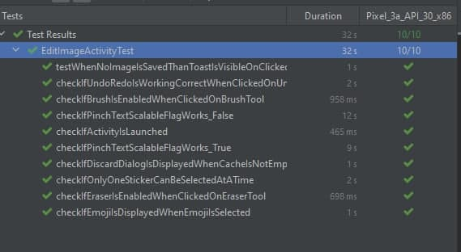

# Lab 9

We created tests for our functionality and edit image activity.

### Files:
com/example/photoeditor/* (androidTest)

### Results:

### Profiling results:

- Memory usage was about 128MB all the time
- Battery usage was low most of the time
- CPU usage was low most of the time and increased during some actions, for example, add text or drawing